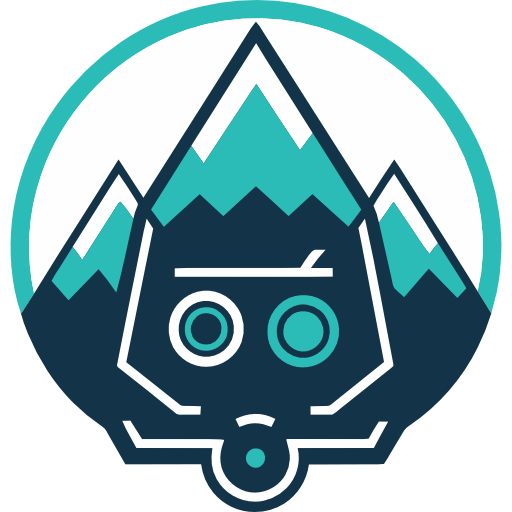

<a name="readme-top"></a>

<!-- PROJECT SHIELDS -->
[![Contributors][contributors-shield]][contributors-url]
[![Forks][forks-shield]][forks-url]
[![Stargazers][stars-shield]][stars-url]
[![MIT License][license-shield]][license-url]
[![Twitter][twitter-shield]][twitter-url]
[![Discord][discord-shield]][discord-url]


<!-- PROJECT LOGO -->
<br />
<div align="center">
  <a href="https://gpteverest.com/">
    
  </a>

  <h3 align="center">GPTEverest</h3>

  <p align="center">
    First operational and AI-powered WordPress assistant
    <br />
    <a href="https://gpteverest.com/docs"><strong>Explore the docs »</strong></a>
    <br />
    <br />
    <a href="https://gpteverest.com/demo">View Demo</a>
    ·
    <a href="https://github.com/jannis24/gpteverest/issues">Report Bug</a>
    ·
    <a href="https://github.com/jannis24/gpteverest/issues">Request Feature</a>
  </p>
</div>


<!-- TABLE OF CONTENTS -->
<details>
  <summary>Table of Contents</summary>
  <ol>
    <li>
      <a href="#about-the-project">About The Project</a>
    </li>
    <li>
      <a href="#getting-started">Getting Started</a>
      <ul>
        <li><a href="#prerequisites">Prerequisites</a></li>
        <li><a href="#installation">Installation</a></li>
      </ul>
    </li>
    <li><a href="#roadmap">Roadmap</a></li>
    <li><a href="#contributing">Contributing</a></li>
    <li><a href="#license">License</a></li>
    <li><a href="#contact">Contact</a></li>
  </ol>
</details>


<!-- ABOUT THE PROJECT -->
## About The Project

[![Product Name Screen Shot][product-screenshot]](https://gpteverest.com/)

GPTEverest is a project created by [Jannis Thuemmig](https://twitter.com/thuemmig) and sponsored by [WP Webhooks](https://wp-webhooks.com).
It aims to bring the power of AI closer to WordPress, allowing everyone to visually interact with their website.
Please keep in mind that this project is in `BETA` and should be used with care as the assistant has acces to the database, WordPress functions, and PHP functions.

While the general structure is there, it needs some training and refinements to properly answer critical questions more precise. Please use with caution.

<p align="right">(<a href="#readme-top">back to top</a>)</p>


<!-- GETTING STARTED -->
## Getting Started

If you just want to try it out, you can generate a demo website by [clicking here](https://gpteverest.com/demo). Otherwise, simply follow the instructions below or visit the [documentation](https://gpteverest.com/docs).

### Prerequisites

You need to have a WordPress website in place to try the plugin.

### Installation

1. Clone the repo into your plugins folder 
   ```sh
   git clone https://github.com/jannis24/gpteverest.git
   ```
3. Head into your WordPress website -> Plugins and acticate GPTEverest
4. In the admin sidebar, click on GPTEverest head to the settings tab
4. Add your OpenAI API key and choose the model/token length (If you're unsure, just leave it as it is)
5. Create your first chat

<p align="right">(<a href="#readme-top">back to top</a>)</p>

<!-- ROADMAP -->
## Roadmap

- [x] Birthday of GPTEverest
- [x] Integrate framework to allow third-party integrations
- [x] Optimize layout
- [ ] Optimize the prompt content
- [ ] Extend AI access features
- [ ] Add more examples

See the [open issues](https://github.com/jannis24/gpteverest/issues) for a full list of proposed features (and known issues).

<p align="right">(<a href="#readme-top">back to top</a>)</p>


<!-- CONTRIBUTING -->
## Contributing

Contributions are what make the open source community such an amazing place to learn, inspire, and create. Any contributions you make are **greatly appreciated**.

If you have a suggestion that would make this better, please fork the repo and create a pull request. You can also simply open an issue with the tag "enhancement".
Don't forget to give the project a star! Thanks again!

1. Fork the Project
2. Create your Feature Branch (`git checkout -b feature/AmazingFeature`)
3. Commit your Changes (`git commit -m 'Add some AmazingFeature'`)
4. Push to the Branch (`git push origin feature/AmazingFeature`)
5. Open a Pull Request

<p align="right">(<a href="#readme-top">back to top</a>)</p>


<!-- LICENSE -->
## License

Distributed under the GPLv3 License. See `LICENSE.txt` for more information.

<p align="right">(<a href="#readme-top">back to top</a>)</p>


<!-- CONTACT -->
## Contact

Your Name - [@ythuemmig](https://twitter.com/thuemmig) - email@example.com

Project Link: [https://github.com/jannis24/gpteverest](https://github.com/jannis24/gpteverest)

<p align="right">(<a href="#readme-top">back to top</a>)</p>

<!-- MARKDOWN LINKS & IMAGES -->
[forks-url]: https://github.com/jannis24/gpteverest/network/members
[contributors-shield]: https://img.shields.io/github/contributors/othneildrew/Best-README-Template.svg?style=for-the-badge
[contributors-url]: https://github.com/jannis24/gpteverest/graphs/contributors
[forks-shield]: https://img.shields.io/github/forks/othneildrew/Best-README-Template.svg?style=for-the-badge
[forks-url]: https://github.com/jannis24/gpteverest/network/members
[stars-shield]: https://img.shields.io/github/stars/othneildrew/Best-README-Template.svg?style=for-the-badge
[stars-url]: https://github.com/jannis24/gpteverest/stargazers
[issues-shield]: https://img.shields.io/github/issues/othneildrew/Best-README-Template.svg?style=for-the-badge
[license-shield]: https://img.shields.io/github/license/othneildrew/Best-README-Template.svg?style=for-the-badge
[license-url]: https://github.com/jannis24/gpteverest/blob/master/LICENSE.txt
[twitter-url]: https://twitter.com/thuemmig
[discord-url]: https://gpteverest.com/discord
[linkedin-shield]: https://img.shields.io/badge/-LinkedIn-black.svg?style=for-the-badge&logo=linkedin&colorB=555
[product-screenshot]: core/includes/assets/img/gpteverest-chat-example-min.png
[Next.js]: https://img.shields.io/badge/next.js-000000?style=for-the-badge&logo=nextdotjs&logoColor=white
[Next-url]: https://nextjs.org/
[React.js]: https://img.shields.io/badge/React-20232A?style=for-the-badge&logo=react&logoColor=61DAFB
[React-url]: https://reactjs.org/
[Vue.js]: https://img.shields.io/badge/Vue.js-35495E?style=for-the-badge&logo=vuedotjs&logoColor=4FC08D
[Vue-url]: https://vuejs.org/
[Angular.io]: https://img.shields.io/badge/Angular-DD0031?style=for-the-badge&logo=angular&logoColor=white
[Angular-url]: https://angular.io/
[Svelte.dev]: https://img.shields.io/badge/Svelte-4A4A55?style=for-the-badge&logo=svelte&logoColor=FF3E00
[Svelte-url]: https://svelte.dev/
[Laravel.com]: https://img.shields.io/badge/Laravel-FF2D20?style=for-the-badge&logo=laravel&logoColor=white
[Laravel-url]: https://laravel.com
[Bootstrap.com]: https://img.shields.io/badge/Bootstrap-563D7C?style=for-the-badge&logo=bootstrap&logoColor=white
[Bootstrap-url]: https://getbootstrap.com
[JQuery.com]: https://img.shields.io/badge/jQuery-0769AD?style=for-the-badge&logo=jquery&logoColor=white
[JQuery-url]: https://jquery.com 